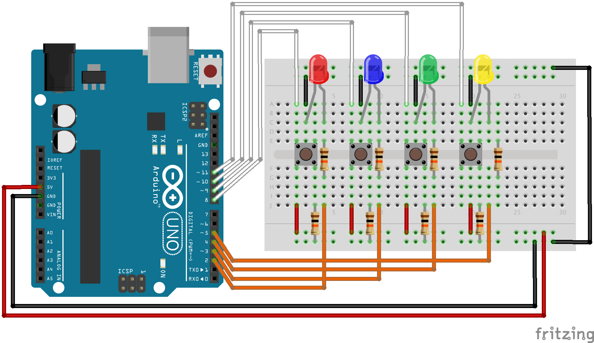

# Genius Game

This is a simple memory game that requires only leds and buttons. The player watches a random sequence of lights and then repeats the same order using the buttons.

## Object Oriented Game

The game was coded using object orientation to make it easier to understand the difference between the buttons and light controllers, and the game controller itself.

### Led Output

This module has utility methods to light leds up, blink them, turn off etc.

### Button Input

The button input reads the pushed button from an array of buttons. It has an interesting feature returning a value ONLY when the user releases the button.

### Genius Game module

It has 2 main states: replay mode and play mode.

#### Replay mode
It randomly selects a number corresponding to a light and stores it in a buffer. It then blinks each light following the buffer order.

#### Play mode
It reads user's input and check if it is correct.

## Usage
Just upload it to your Arduino board.
